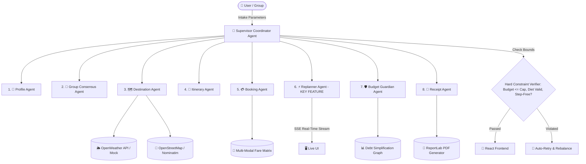

# 🌍 WanderMind: Autonomous Multi-Agent Trip Planner & Real-Time Replanning Engine

> **University Project for "Fundamentals of Artificial Intelligence"**  
> An autonomous multi-agent system that understands travelers, builds customized itineraries, secures simulated bookings, and **dynamically replans trips in real time** when weather, transit, or group conditions change.

---

## 📌 1. Problem Statement (R1)

Traditional travel planners (and static LLM chatbots) generate a rigid itinerary and **completely fail the moment reality changes**:
- 🌧️ It starts raining and outdoor attractions become inaccessible.
- 🚫 Key monuments or ferries close unexpectedly for maintenance or VIP events.
- 🚆 Trains get delayed by 2 hours, throwing off hotel check-in and lunch reservations.
- 👴 Elders face steep walking exhaustion, or group members argue over dietary requirements.

**WanderMind solves this** by transforming trip planning into an **autonomous, event-driven Multi-Agent Mesh** that observes shifts, re-scores schedules, swaps outdoor for indoor stops, and delivers an instant **BEFORE vs AFTER diff** with line-by-line reasons while strictly guaranteeing hard budget, dietary, and mobility bounds.

---

## 🤖 2. Multi-Agent Architecture (R2, R3, R5)

WanderMind implements a **LangGraph-styled Supervisor & Specialist Agent Architecture** executing continuous **Observe ➔ Think ➔ Act ➔ Check** cycles:



### Specialist Agent Breakdown

| # | Agent Name | Primary Responsibility | Key Decision Logic & Tools |
|---|------------|------------------------|-----------------------------|
| **1** | **Profile Agent** | Intake validation & Persona classification | Calculates 5-slice animated donut (30% Travel, 30% Stay, 20% Food, 10% Activities, **10% Locked Emergency Buffer**). |
| **2** | **Group Consensus Agent** | Multi-preference conflict resolution | Takes private member preferences, calculates **Nash-Fairness Score (0-100)**, and details compromises. |
| **3** | **Destination Agent** | Multi-criteria destination ranking | Evaluates 8 Indian destinations (Goa, Jaipur, Munnar, Manali, Hampi, Varanasi, Coorg, Andaman) with Match Scores (0-100), weather, and tier pricing. |
| **4** | **Itinerary Agent** | Day-by-day, hour-by-hour routing | Paces activities with transit times, entry fees, diet-matched food guide, packing list, emergency SOS, and **Plan B for every single day**. |
| **5** | **Booking Agent** | Multi-modal fare comparison & simulated checkout | Ranks top 3 as **Cheapest / Fastest / Best Value**, flags non-refundable fares, and generates simulated tickets. |
| **6** | **Replanner Agent (KEY)** | Real-time adaptive replanning | Triggered by rain, delays, closures, or fatigue. Swaps outdoor for indoor stops and returns an animated **BEFORE vs AFTER diff** with reasons per change. |
| **7** | **Budget Guardian Agent** | Real-time spend tracking & group cost splitter | Tracks actual vs planned expenses, detects overspends, auto-rebalances remaining days, and calculates who-owes-whom debt graphs. |
| **8** | **Receipt Agent** | Official PDF receipts & memory book | Generates high-res ReportLab PDF receipts with verification QR codes, calendar invites (.ics), and WhatsApp summaries. |

---

## 💻 3. Technology Stack (R4)

- **Frontend (React 18 + Vite)**:
  - Functional components & React Hooks
  - Tailwind CSS for styling with glassmorphism & dark/light mode
  - Framer Motion for animations & page transitions
  - Recharts for budget donut & spend analytics
  - React-Leaflet & OpenStreetMap for interactive route drawing
  - Zustand for centralized global state
  - Server-Sent Events (`EventSource`) for live `<AgentActivityPanel />` telemetry
  - react-hot-toast & react-confetti for simulated checkout feedback
- **Backend (Python FastAPI)**:
  - FastAPI with async endpoints & streaming SSE routes
  - Pydantic v2 data models & validation
  - SQLite database for persistent trips, bookings, expenses, and logs
  - ReportLab PDF generator & QRCode engine
  - OpenWeather API & Nominatim tools with **100% reliable mock fallbacks** (Demo data badge)

---

## 🚀 4. Quick Start & Setup Guide

### Prerequisites
- Python 3.10+
- Node.js v18+ and npm

### Backend Setup
```bash
cd backend
python -m pip install -r requirements.txt
# Run the FastAPI server
python -m uvicorn main:app --reload --port 8000
```
Backend will be live at `http://127.0.0.1:8000` (Swagger docs at `http://127.0.0.1:8000/docs`).

### Frontend Setup
```bash
cd frontend
npm install
npm run dev
```
Frontend will be live at `http://localhost:5173`.

---

## 🧪 5. Testing & Verification

Run the automated backend agent test suite:
```bash
cd backend
python -m pytest tests/
```
Run automated university benchmark evaluation suites directly from the UI at `/evaluation` or via API at `GET /api/evaluation`.

---

## 📊 6. Hard Constraint Guarantees Tested
1. **Hard Budget Cap**: Total proposed cost never exceeds user budget; 10% emergency buffer is strictly preserved.
2. **Diet Compliance**: 100% strict verification for Vegetarian, Jain (no root vegetables), or Halal requirements.
3. **Elder & Kid Accessibility**: Step-free access and elevator-verified stops enforced when elder mode is toggled.
4. **All-Weather Plan B**: Every single day includes an indoor museum/workshop backup timeline ready to deploy.
